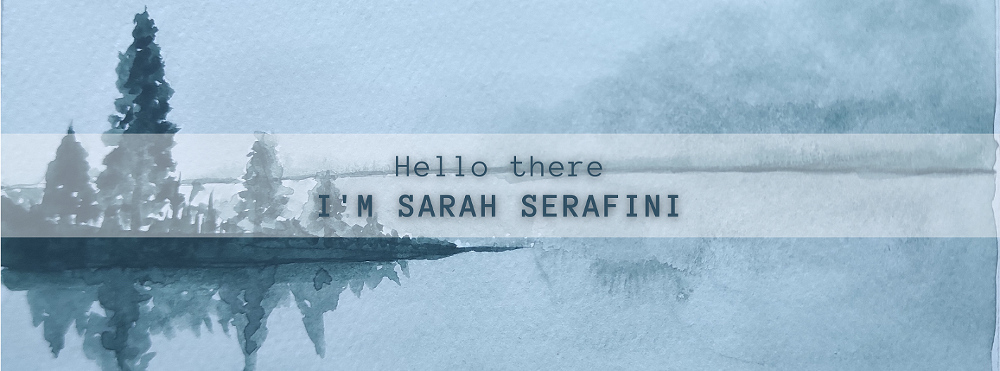

I'm a Data Scientist with a background as a forest ecology researcher. I have always being passionate about analysing data through different meanings, to uncover pattern and trends. During my career I have been responsible for all the phases of model development through Python and R. 

Other random things I love to do with my time: reading, weight-lifting, plant-parenting, and watercolour painting.

### Contacts
 

## Skills:

#### 🎨 Languages:

&nbsp;

#### 📊 Python Data Analysis/Visualization Libraries:

#### 📊 R Data Analysis/Visualization Packages:

#### 🤖 ML/DL frameworks

&nbsp;

#### 💫 Tools for Collaborative Development

&nbsp;

#### 🏔️ IDEs

&nbsp;
&nbsp;

